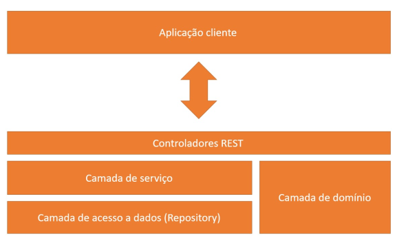

 Software engineer intern
### **Objetivos a se aprender**
Nessa atividade viso o parendizado sobre os intens abaixo:
1.  ****IMPLEMENTAÇÃO DO MODELO CONCEITUAL****
2.  ****OPERAÇÕES DE CRUD E CASOS DE USO****
3.  ****BANCO DE DADOS MYSQL E IMPLANTAÇÃO NO HEROKU****
4.  ****SERVIÇO DE EMAIL****
5.  ****ARMAZENAMENTO DE IMAGENS USANDO AMAZON S3****
6.  ****APLICAÇÃO IONIC****

### **Pré-requisitos**

-   Java JDK Installed to Run Liferay
    -   Download here: [https://www.oracle.com/technetwork/java/javase/downloads/jdk11-downloads-5066655.html](https://www.oracle.com/technetwork/java/javase/downloads/jdk11-downloads-5066655.html)
    -   docker: [https://www.docker.com/products/docker-desktop](https://www.docker.com/products/docker-desktopl)
        - conhecimento básico de como criar container docker
    - Programação orientada a objetos: [Aulas youtube](https://www.youtube.com/watch?v=KlIL63MeyMY&list=PLHz_AreHm4dkqe2aR0tQK74m8SFe-aGsY&ab_channel=CursoemV%C3%ADdeo)

### **API REST**

### **Entidade de Relacionamento**

